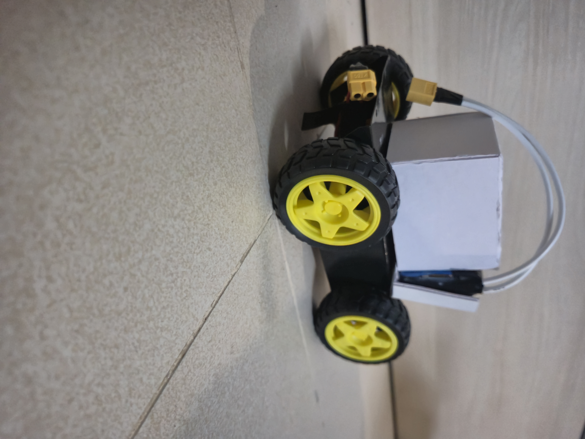
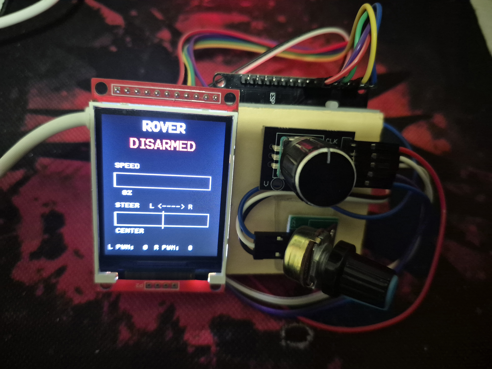

# EdgeRover 🤖

A 4-wheeled robot learning to drive itself — starting with a human on the stick, ending with [EdgeCV](https://github.com/) doing the thinking.

> **Current Status:** ESP-NOW control layer done and flying. Vision integration next.

---

## Overview

EdgeRover is a ground-up hardware + firmware project. The current build: a purpose-built **ESP-NOW link between two ESP32s** — a handheld transmitter with real analog control (potentiometer speed, rotary-encoder steering) talking to a receiver that drives a **TB6612FNG** with actual PWM, not just direction pins.

This isn't just a wiring project — it's the interface the autonomous stack needs. The receiver speaks a simple, stable language: *left wheel PWM, right wheel PWM.* That's exactly the shape of output a vision model produces too.

**Next (in progress):** Swap the transmitter for [EdgeCV](https://github.com/) — the onboard ESP32-CAM classifier that's already proven it can run real-time int8 inference on a $10 microcontroller. Same receiver, same packet contract, different brain. **This is the point of the whole build: EdgeRover is where EdgeCV's proof-of-concept stops being a bench demo and starts driving a real machine around a real room.**

<p align="center">
  
  
</p>

---

## Why it's built this way

- **Speed control** means every start is a controlled ramp, not a full-current lurch — fine for a joystick, a liability for a vision loop making dozens of decisions a second.
- **ESP-NOW** is a low-latency, connectionless link purpose-fit for a robot that needs to take commands from its own onboard model, not just a human with a gamepad.
- The packet format is built around left-speed/right-speed, not stick axes — exactly the output a classifier or a nav stack actually wants to emit. The receiver doesn't know or care whether those numbers came from a knob or a model.

---

## Roadmap

### ✅ ESP-NOW Control Link (Complete)
- Dedicated transmitter ↔ receiver pair over ESP-NOW (no phone, no BT stack)
- Potentiometer sets a shared PWM speed ceiling (0–255) — softer starts, no more current-spike lurch
- Rotary encoder provides differential steering: turning only slows the *inner* wheel, outer wheel holds the ceiling
- Encoder's built-in pushbutton doubles as arm/disarm (debounced press-to-toggle)
- ILI9225 status screen: armed state, speed %, steering %, raw L/R PWM
- TB6612FNG driven with real LEDC PWM (20 kHz / 8-bit), replacing tied-HIGH direction-only control
- `ControlPacket` designed around `leftPWM`/`rightPWM` — receiver doesn't know or care where the numbers came from

### 🔧 Autonomous Handoff (In Progress)
- Port EdgeCV's onboard classifier output into the same `leftPWM`/`rightPWM` packet contract
- Obstacle avoidance and person-tracking behaviors driving the rover directly, no transmitter in the loop
- Manual override retained (arm/disarm + a mode bit already exist in the packet for exactly this)

---

## Drive Architecture

Differential (tank) drive — two independently driven sides, pivot turns, no steering servo. What matters is how each side's speed gets decided:

```
Transmitter                          Receiver
------------                         --------
pot        -> speed ceiling (0-255)
encoder    -> steering offset   \
                                  +-> leftPWM, rightPWM  --[ESP-NOW]-->  ledcWrite(PWMA/B)
encoder SW -> armed latch       /                                       TB6612FNG -> motors
```

The steering math: outer wheel always gets the full ceiling; inner wheel gets `ceiling × (1 − |steps| / max_steps)`, floor at 0 for a full-lock pivot. Simple, predictable, and just arithmetic on two numbers — it doesn't care where they came from.

---

## Hardware

| Component | Details |
|---|---|
| Link | ESP-NOW, dual ESP32 |
| Motor driver | TB6612FNG |
| Speed control | PWM, 0–255, pot-limited ceiling |
| Steering input | Rotary encoder (detented) |
| Arm/disarm | Encoder pushbutton, debounced toggle |
| Status feedback | ILI9225 SPI TFT |
| Chassis | 4WD kit |
| Power | 6V NiMH (4s) |

---

## Repository Structure

```
EdgeRover/
├── README.md
├── devlog.md
└── images/
│   ├── car.jpg
│   └── controller.jpg
│
└── src/
    ├── motor_control/ 
    │   ├── transmitter/                 # handheld controller
    │   │   ├── transmitter.ino
    │   │   ├── inputs.h
    │   │   ├── inputs.cpp
    │   │   ├── display.h
    │   │   ├── display.cpp
    │   │   ├── espnow_tx.h
    │   │   ├── espnow_tx.cpp   
    │   │   └── packet.h
    │   │
    │   └── receiver/                    # onboard, drives the TB6612FNG
    │       ├── receiver.ino
    │       ├── outputs.h
    │       ├── outputs.cpp
    │       ├── espnow_rx.h
    │       ├── espnow_rx.cpp
    │       └── packet.h
    │
    └── vision_control/                  # EdgeCV output wired into the same packet contract as motor_control/
```

> **Heads up:** `packet.h` must be byte-identical in both `transmitter/` and `receiver/` — Arduino sketches don't share headers across folders, and this struct is sent over the wire raw (`__attribute__((packed))`). If you edit one copy, copy it into the other, or the two boards will silently disagree about what a byte means.

---

## Control Logic

| Input | Effect |
|---|---|
| Pot at 0 | Both wheels stopped regardless of steering |
| Pot at max, encoder centered | Both wheels at full ceiling — straight ahead |
| Pot at max, encoder turned right | Right wheel ramps down toward 0, left holds ceiling — pivots right |
| Pot at max, encoder turned left | Left wheel ramps down toward 0, right holds ceiling — pivots left |
| Encoder button pressed | Toggles armed/disarmed |
| Disarmed (either side) | STBY dropped on the TB6612FNG — hardware-level stop, not just direction pins at 0 |

---

## Pin Connections

**Transmitter**

| GPIO | Function |
|---|---|
| 26 | Speed potentiometer (⚠️ ADC2 — see `devlog.md`) |
| 13 | Encoder switch (arm/disarm) |
| 12 | Encoder DT |
| 14 | Encoder CLK |
| 5 / 15 / 19 / 4 / 18 | ILI9225: CLK / SDA / RS / RST / CS |

**Receiver**

| GPIO | Function |
|---|---|
| 16 / 17 | Left motor direction (AIN1/AIN2) |
| 18 / 19 | Right motor direction (BIN1/BIN2) |
| 21 | TB6612FNG STBY |
| 26 / 27 | Left/right motor PWM (LEDC) |

---

## Getting Started

**Dependencies:**
- [Arduino IDE](https://www.arduino.cc/en/software) with ESP32 board support
- `Adafruit GFX Library` + `Adafruit ILI9225` (Library Manager)

**Steps:**
1. Flash `src/motor_control/receiver/receiver.ino` to the onboard ESP32, note the MAC address it prints.
2. Set that MAC in `src/motor_control/transmitter/espnow_tx.cpp` (`RECEIVER_MAC`).
3. Flash `src/motor_control/transmitter/transmitter.ino` to the handheld ESP32.
4. Power both up, arm via the encoder button, drive.

---

## Devlog

Every bug, every wrong turn, every fix — from the throttle deadzone that never triggered to the display that turned out to be the wrong chip entirely — is in [`devlog.md`](./devlog.md).

> **Running into a debugging, wiring/connection, or logic issue?** Check [`devlog.md`](./devlog.md) first — it's a running log of mistakes actually made on this project and how each one was root-caused and fixed (pin conflicts, driver mismatches, debounce vs. state-machine issues, etc.). Good chance whatever you're hitting has already been hit and solved here.

---

*Building toward autonomous edge robotics, one phase at a time. EdgeCV proves the model can see — EdgeRover is where it learns to move.*
