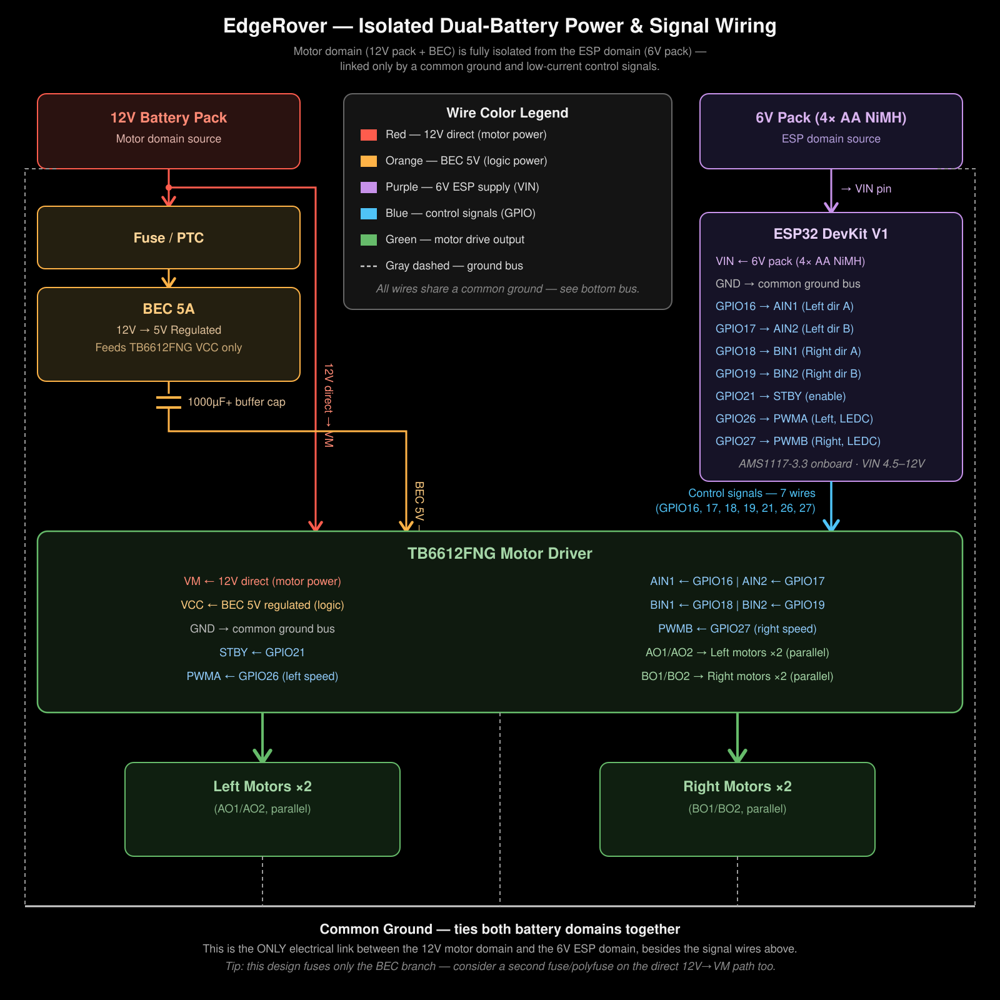

# EdgeRover 🤖

A 4-wheeled robot learning to drive itself — starting with a human on the stick, ending with the rover following a person around a room on vision alone.

> **Current Status:** Manual control (ESP-NOW, tank-turn + in-place pivot) is code-complete and compiles clean — bench testing pending, blocked on hardware access. Electrical rework is done: motor-load resets traced to EN-pin noise coupling (not brownout) and fixed via BEC-unified logic rail + EN-pin cap + motor snubbers + star ground. Next up: AprilTag-based visual following.

<p align="center">
  
  
</p>
<p align="center"><sub>The rover (left) and the handheld ESP-NOW controller it started life under (right).</sub></p>

---

## Overview

EdgeRover is a ground-up hardware + firmware project: a 4WD chassis that started life under manual ESP-NOW control and is now being converted into an autonomous follower. The rover tracks a printed **AprilTag** worn/carried by a person, steers toward it using nothing but the tag's pixel position and apparent size in frame, and stops when it gets close enough — all decision-making running locally on an ESP32-S3-CAM, no host PC, no ROS/micro-ROS, no CNN.

This is deliberately **not** a CNN/vision-model project for the core following behavior. AprilTag detection is classical computer vision — deterministic, lightweight, and it hands you exactly the two numbers the control loop needs: where the tag is in the frame, and how big it is. No training data, no inference engine required for v1.

---

## Why AprilTag, not a learned model

- A CNN-based "follow a hand/shoe" approach was considered and shelved for v1 — multiple hands/shoes in frame create ambiguity a bounding-box detector can't resolve on its own, and it needs a trained model + dataset before it does anything.
- AprilTag detection gives an unambiguous single target (unique ID, precise corners) with zero training, and the tag's apparent size in frame is enough to estimate distance via the pinhole camera model — no depth sensor, no stereo camera, no CNN.
- The CNN-based approach (hand/shoe detection via Edge Impulse FOMO + ESP-DL) remains a documented future extension — see [Roadmap](#roadmap).

---

## Why it's built this way

- **Reactive, not planned.** No map, no localization, no path planning — just "where's the tag, how big is it, react." This is the right amount of autonomy for "go where it can and follow," not full navigation.
- **Fully local.** The entire detect → steer → speed decision loop runs on the ESP32-S3-CAM. No WiFi dependency, no external agent, no host computer in the loop.
- **Speed control via PWM ceiling + distance-based ramp** means the rover decelerates smoothly as it closes in on the target instead of lurching to a stop.
- **Differential (tank) drive** — two independently driven sides, pivot turns, no steering servo — keeps the mechanical side simple so all the interesting work happens in the vision/control math.

---

## Electrical Architecture

### Current build — BEC-fed logic, 12V direct to motor power, single star ground

| Component | Spec |
|---|---|
| Motor battery | 12V pack — feeds BEC input **and** TB6612FNG `VM` directly |
| BEC | 5A-rated, regulated 5V output — feeds **ESP32 VIN and TB6612FNG `VCC` (logic) only**, never motor power |
| Camera | ESP32-S3-CAM / ESP32 DevKit V1 (onboard AMS1117-3.3, VIN accepts ~4.5–12V) |
| Drive motors | 4× DC gear motors (4WD) |
| Motor driver | TB6612FNG (or equivalent H-bridge rated for 4-motor draw) |
| Noise mitigation | 0.1–1µF cap on ESP32 `EN`→GND, 0.1µF snubber cap across each motor's terminals, 100–470µF bulk cap on ESP32 `VIN`→GND |


> ⚠️ Diagram is stale as of this revision — it still shows the earlier isolated dual-battery layout, not the BEC-unified-logic topology described below. Needs re-drawing.

One battery (12V), one regulator (5A BEC), but the BEC's output only ever touches **logic-level** current — ESP32 + TB6612FNG `VCC`. Actual motor drive current (`VM`) comes straight off the 12V pack and never passes through the BEC at all. This keeps the ESP32 electrically distanced from the high-current motor path while avoiding the ground-topology complexity of running two entirely separate batteries.

**All grounds — 12V pack negative, BEC ground, TB6612FNG `GND`, ESP32 `GND` — land on a single, soldered, star ground point**, not daisy-chained through each other. This matters more than it sounds like it should: motor return current physically flows through whatever wire segment it's routed through, and if that segment is shared with a "quiet" node like the ESP32's ground reference, the IR drop across that shared wire shows up as noise/ground-bounce at the ESP32, indistinguishable from an actual supply dip unless you go looking for the wiring topology specifically.

### How this evolved

1. **4S battery pack + bulk capacitors (2200µF, then 470µF) directly on the supply rail** — motor current draw at startup/stall caused voltage sag severe enough to reset the ESP32. Capacitors alone were a band-aid: they smooth transients but don't fix a supply that can't source enough sustained current.
2. **Single regulated 5A BEC feeding both the ESP32-S3-CAM and all 4 motors off one rail** — fixed the root current-delivery problem, but the ESP32 still occasionally reset near full motor power, since it shared a regulator and rail with the motor load.
3. **Fully isolated dual-battery domains** (6V NiMH dedicated to ESP32, 12V + BEC for motors, joined only at a common ground) — removed the shared rail entirely. Still reset near full motor power, at a repeatable PWM threshold (~27/255). Root-caused via a controlled test: powering the ESP32 from a PC's USB port (fully independent of *both* battery packs) still reproduced the reset at the same threshold, with reset reason `POWERON_RESET` rather than a brownout code — proving this was never a supply-sag problem at all. The real mechanism was motor switching/back-EMF noise coupling into the ESP32's `EN` (reset) pin via the shared ground path.
4. **Current: BEC-unified logic rail (this section)**, plus targeted noise fixes — an `EN`-to-GND capacitor (raised the reset-free PWM threshold immediately, from ~27/255 to ~99/255 on its own), snubber capacitors across each motor's terminals (kills back-EMF at the source instead of filtering it downstream), and rebuilding the ground wiring as a genuine single-point star instead of anything daisy-chained. Combined, these resolved the resets completely — full 0–255 PWM range confirmed stable.

### Wiring checklist

- **Star ground, soldered, not daisy-chained:** 12V pack negative, BEC ground, TB6612FNG `GND`, and ESP32 `GND` all land on one common point. No ground wire should ever be routed *through* another component on its way to this point.
- 0.1–1µF ceramic capacitor between ESP32 `EN` and `GND`, as close to the module as possible. Safe to leave in permanently — most DevKit boards already ship with a smaller cap here for the auto-upload reset circuit; this just adds more filtering. Only watch for: values much above ~1µF can occasionally slow the auto-reset timing used by `esptool`/Arduino IDE uploads — if uploads ever get flaky, hold `BOOT` manually during flash, or reduce the cap value.
- 0.1µF ceramic snubber capacitor across each DC motor's terminals, soldered as close to the motor body as possible — kills brush/commutation noise at the source.
- 100–470µF bulk capacitor across ESP32 `VIN`–`GND`, close to the board — local reservoir for WiFi TX current spikes, cheap insurance.
- Fuse or polyfuse between the 12V pack and the BEC input.
- Bulk capacitor (1000µF+) across the BEC output — supplementary smoothing on the logic rail.
- PWM/direction signal wires from ESP32 to TB6612FNG: keep runs short and physically separated from motor power leads (cross at 90° if they must cross; don't bundle them together) — reduces the chance of noise coupling directly onto signal lines independent of the ground path.
- Confirm the BEC output lands on the ESP32's `VIN`/`5V` pin, never `3V3` directly (which bypasses the onboard regulator and would overvolt the MCU).
- If resets ever reappear near full motor power: check the star ground first (a loosened solder joint or a jumper that's crept back into a daisy-chain arrangement reproduces this exact symptom), then confirm the EN cap and motor snubbers are still intact — in that order, since that's the order these were actually diagnosed and fixed in.

---

## Software Stack

| Layer | Tool |
|---|---|
| Framework | ESP-IDF (preferred over Arduino here — more control over camera driver + easier integration of a C detection library) |
| Camera driver | `esp32-camera` (Espressif official component) |
| AprilTag detection | Port of the UMich `apriltag` C library (or lighter ArUco-style detector if frame rate demands it) |
| Motor control | ESP32 LEDC peripheral, PWM |

---

## Control Loop

```
loop (target ~15–30 fps, camera-limited):
    frame = capture_frame()
    detections = apriltag_detect(frame)

    if len(detections) > 0:
        tag = pick_best(detections)      # e.g., largest / highest confidence
        cx, cy = tag.center
        size_px = tag.apparent_size

        steer_error = compute_steer_error(cx, frame_width)
        distance_est = estimate_distance(size_px)

        if distance_est <= STOP_DISTANCE:
            motors.stop()
        else:
            speed = compute_speed(distance_est)
            turn  = compute_turn(steer_error)
            motors.drive(speed, turn)
    else:
        motors.stop()   # v1 default; frame-exit-direction logic is a planned upgrade
```

---

## Math Reference

### Steering error

```
frame_center_x = W / 2
error_x = cx - frame_center_x
error_x_norm = error_x / (W / 2)        # -1.0 (full left) to +1.0 (full right)
```

`error_x > 0` → tag right of center → steer right. `|error_x| < deadzone` → go straight (start deadzone ≈ 5% of frame width to kill jitter).

### Turn command (proportional, optionally PD)

```
turn = Kp * error_x_norm
turn = Kp * error_x_norm + Kd * (error_x_norm - prev_error_x_norm) / dt   # if oscillation appears
```

Tune `Kp` empirically, starting ~0.3–0.5.

### Distance from apparent tag size (pinhole camera model)

```
distance = (real_tag_size × focal_length_px) / apparent_tag_size_px
```

- `real_tag_size` — physical side length of the printed tag (fixed, measured once)
- `focal_length_px` — camera focal length in pixels (calibrate below)
- `apparent_tag_size_px` — measured tag side length in the current frame

**Calibration (one-time):** place tag at known distance `D_known`, measure `apparent_tag_size_px`, then:

```
focal_length_px = (apparent_tag_size_px × D_known) / real_tag_size
```

### Speed mapping (smooth deceleration on approach)

```
if distance <= STOP_DISTANCE:      speed = 0
elif distance <= SLOW_DISTANCE:    speed = map(distance, STOP_DISTANCE, SLOW_DISTANCE, MIN_SPEED, MAX_SPEED)
else:                              speed = MAX_SPEED

map(x, in_min, in_max, out_min, out_max) =
    (x - in_min) × (out_max - out_min) / (in_max - in_min) + out_min
```

### "Target has stopped" detection

```
size_history = [last N frames of apparent_tag_size_px]     # e.g., N = 10 @ 20fps
variance = statistical_variance(size_history)

if variance < STILL_THRESHOLD and distance > STOP_DISTANCE:
    motors.stop()   # target present but not moving — hold
```

### PWM duty (ESP32 LEDC) + differential drive mixing

```
duty_value = speed_fraction × (2^resolution_bits - 1)

left_speed  = clamp(speed - turn, MIN_PWM, MAX_PWM)
right_speed = clamp(speed + turn, MIN_PWM, MAX_PWM)
```

(Verify sign convention empirically against your wiring, then keep it consistent.)

---

## Constants Checklist (before first test)

- [ ] `real_tag_size` — measured, cm
- [ ] `focal_length_px` — calibrated per above
- [ ] `STOP_DISTANCE`, `SLOW_DISTANCE`
- [ ] `Kp` (and `Kd` if needed) — tune wheels-off-ground first
- [ ] `deadzone` — start ~5% of frame width
- [ ] `STILL_THRESHOLD`
- [ ] `MIN_SPEED` / `MAX_SPEED` — respect motor driver + BEC current limits

---

## Roadmap

### ✅ ESP-NOW Manual Control (Complete, superseded)
- Original handheld transmitter ↔ receiver ESP-NOW link with pot-based speed ceiling and rotary-encoder steering — proved out PWM motor control and packet-based control architecture. No longer the primary control path, but the wiring/PWM groundwork carries forward.

### 🏁 Competition Prep — Tank-Turn Steering (Current Priority)
Robo race entry: square track, rounded corners — one side has an oil/slip section, one side has a ramp, one side is clean, and the last side ends in a standing-block obstacle course requiring tight maneuvering right as the rover exits the corner. Three laps, best lap counts.

**Current focus: get the existing skid-steer (tank-turn) mixing as precise and reliable as possible.** This is the control scheme that will actually run at competition unless confirmed otherwise.

- **Superseded the old floor-based turning (`MIN_INNER_FACTOR`) with a through-zero design.** The previous approach tapered the inner wheel down to a fixed 35% floor and never lower — it prevented a dead stop at full lock, but also made a true in-place pivot unreachable while driving. The inner wheel now follows `1.0 - 2×turnFactor`: full forward at center, exactly `0` at half steering lock, ramping into genuine reverse toward full lock — smoothly covering everything from a gentle curve to a zero-radius spin within one continuous formula, no separate mode required.
- **In-place pivot, no new hardware:** when the throttle pot is idle and the steering encoder is deflected past a small deadband, both wheels drive at equal magnitude in opposite directions, scaled by how far the encoder is turned. Reuses the existing pot + encoder — moving throttle out of idle hands control back to the normal turning behavior above.
- **`ControlPacket` bumped to v3:** `leftPWM`/`rightPWM` changed from `uint8_t` (0–255, forward-only) to `int16_t` (-255..255, sign = direction). This is what makes the reverse-capable inner wheel and pivot possible — the old unsigned fields had no way to represent "spin this wheel backward." `outputs.cpp` now derives the TB6612FNG direction pins from the sign of each value instead of hardcoding forward.
- **Status: code-complete, compiles clean, not yet bench-tested** — testing is blocked on hardware access (ESP32 not currently on hand). First test must be wheels-off-ground: confirm pivot spins the expected direction at a low `PIVOT_PWM_MAX` (start ~80–100, default guess is `180`) before trusting it at speed, since the new turn curve is meaningfully sharper past half steering lock than the old floored version and will feel different even in normal (non-pivot) turns.
- `PIVOT_PWM_MAX`, `THROTTLE_DEADBAND`, and `STEER_DEADBAND` are starting guesses, not calibrated — need a proper bench pass followed by track-condition testing, especially through the obstacle section where turn precision matters most.
- Reverse driving (independent of pivot) was considered and deliberately dropped — doesn't add value for this track layout, and keeps the arm/disarm switch as the only safety-critical button rather than overloading it or the (fully committed) button pins with a second role.
- Considered switching the front axle to a servo-actuated steering knuckle (Ackermann/car-style) for better traction through the oil section, since skid-steering relies on friction to turn and that breaks down on a slippery surface. **Parked for now** — car-style steering has a real minimum turn radius and can't pivot in place, which would hurt badly in the obstacle course (the section that likely matters most for lap time). Possible future direction if competition rules allow a **dual-mode** setup (servo-steered for the oil section, tank-turn for everything else, toggled via the spare pot/encoder/switch already on hand) — but that depends on confirming it's allowed, and isn't the priority until tank-turn itself is bench- and track-validated.

### 🔧 AprilTag Visual Following (In Progress)
- Electrical rework: 4S + capacitor setup → 5A BEC (see [Electrical Architecture](#electrical-architecture))
- `vision_control/apriltag_follower/` firmware written: camera capture, AprilTag (tag36h11) detection, steering/distance/still-target control math, forward-only PWM mixing, sends `ControlPacket` to the existing, unmodified `receiver/`
- Remaining: vendor the AprilTag C library into the build, calibrate `REAL_TAG_SIZE_CM`/`FOCAL_LENGTH_PX`, tune `STEER_KP`/`STOP_DISTANCE_CM`/etc. in `constants.h`
- Bench testing wheels-off-ground before first drive test

### 🔭 Future Extensions
- Frame-exit reactive behavior: rover reacts differently depending on whether the tag exits frame left, right, or top (and whether it was shrinking or growing before it vanished) — disambiguates "target walked away" vs. "target got too close."
- Hand/shoe-based following via a small trained model (Edge Impulse FOMO, deployed via ESP-DL) as an alternative to the AprilTag, once marker-following is solid.
- Second onboard camera for rear-facing detection.
- micro-ROS bridge — only if telemetry visualization on a PC or integration with a broader ROS-based system becomes a goal. Not required for the core following behavior.

---

## Drive Architecture

Differential (tank) drive — two independently driven sides, pivot turns, no steering servo. The steering math (§ [Math Reference](#math-reference)) computes `left_speed`/`right_speed` directly from the tag's position and size; the receiver-side logic doesn't need to know or care that the numbers now come from vision instead of a rotary encoder.

> **Conditional idea, not built:** a servo-actuated front axle for car-style (Ackermann) steering, toggled against tank drive via a mode switch, was considered for the competition's oil/slip section specifically. Not pursued unless confirmed allowed by competition rules — see [Competition Prep](#-competition-prep--tank-turn-steering-current-priority) in the Roadmap.

---

## Hardware

| Component | Details |
|---|---|
| Camera / compute | ESP32-S3-CAM (PSRAM) |
| Target marker | Printed AprilTag, fixed known size |
| Motor driver | TB6612FNG (or higher-current equivalent — confirm against 4-motor draw) |
| Drive motors | 4× DC gear motors (4WD) |
| Power | 12V battery pack + 5A BEC |
| Chassis | 4WD kit |

---

## Repository Structure

```
EdgeRover/
├── README.md
├── devlog.md
├── images/
│   ├── car.jpg
│   ├── controller.jpg
│   └── rover_power_wiring.svg
└── src/
    ├── bot_controller/
    │   ├── transmitter/                 # handheld controller (manual mode, superseded by vision)
    │   │   ├── transmitter.ino
    │   │   ├── inputs.h
    │   │   ├── inputs.cpp
    │   │   ├── display.h
    │   │   ├── display.cpp
    │   │   ├── espnow_tx.h
    │   │   ├── espnow_tx.cpp
    │   │   └── packet.h
    │   └── receiver/                    # onboard, drives the TB6612FNG (unchanged, shared by both control modes)
    │       ├── receiver.ino
    │       ├── outputs.h
    │       ├── outputs.cpp
    │       ├── espnow_rx.h
    │       ├── espnow_rx.cpp
    │       └── packet.h
    └── vision_control/
        └── apriltag_follower/            # ESP32-S3-CAM: detects tag, drives receiver/ directly
            ├── apriltag_follower.ino     # main loop: capture -> detect -> control -> send
            ├── camera.h                  # esp32-camera init + grayscale frame capture
            ├── camera.cpp
            ├── tag_detector.h            # AprilTag (tag36h11) detection wrapper
            ├── tag_detector.cpp
            ├── tracker_control.h         # steering/distance/PWM mixing math
            ├── tracker_control.cpp
            ├── constants.h               # all tunables/calibration constants, uncalibrated by default
            ├── packet.h                  # copied byte-identical from bot_controller/
            ├── espnow_tx.h                # copied unchanged from bot_controller/transmitter/
            └── espnow_tx.cpp
```

> **Heads up:** `packet.h` must be byte-identical across every folder that sends or receives a `ControlPacket` — Arduino sketches don't share headers across folders, and this struct is sent over the wire raw (`__attribute__((packed))`). If you edit one copy, copy it into all the others, or boards will silently disagree about what a byte means.
>
> **`PACKET_VERSION` is now `3`:** `leftPWM`/`rightPWM` changed from `uint8_t` to `int16_t` (sign = direction, magnitude = duty) to support tank-turn's reverse-capable inner wheel and in-place pivot. Any copy of `packet.h` still on v2 (unsigned fields) is incompatible — mismatched transmitter/receiver builds won't just get rejected by the version check, they'll misinterpret the struct's byte layout entirely since the field widths changed.
>
> `vision_control/apriltag_follower/` reuses `bot_controller/receiver/` **as-is, unmodified** — the receiver only understands `leftPWM`/`rightPWM`, so it doesn't care whether those numbers came from the handheld transmitter or the onboard camera. Its own PWM mixing is still forward-only (v1) and hasn't been updated to emit signed/reverse values — worth keeping in mind if pivot-style behavior is ever wanted from the vision path too. `apriltag_follower/` additionally requires the UMich AprilTag C library vendored in separately (not included in this repo — see `tag_detector.cpp` for integration notes).

---

## Getting Started

**Dependencies:**
- Arduino IDE (or arduino-cli) with ESP32 board support
- `esp32-camera` component (Espressif)
- UMich AprilTag C library, vendored separately — see the top comment in `tag_detector.cpp` for integration notes (not bundled in this repo)

**Steps:**
1. Verify power rail first: confirm BEC output voltage under load with motors connected, per [Electrical Architecture](#electrical-architecture), before flashing/running any vision code.
2. Flash `src/bot_controller/receiver/receiver.ino` to the onboard ESP32 (unchanged from manual-control days), note the MAC address it prints.
3. Set that MAC as `RECEIVER_MAC` in `src/vision_control/apriltag_follower/espnow_tx.cpp`.
4. Print your AprilTag (tag36h11 family) at a known, fixed size — measure it precisely.
5. Fill in `REAL_TAG_SIZE_CM` in `src/vision_control/apriltag_follower/constants.h`.
6. Calibrate `FOCAL_LENGTH_PX` (known-distance method, see [Math Reference](#math-reference)) and set it in `constants.h`.
7. Flash `src/vision_control/apriltag_follower/apriltag_follower.ino` to the ESP32-S3-CAM.
8. Bench test wheels-off-ground — watch serial output, confirm computed `leftPWM`/`rightPWM` behave sensibly as the tag moves before trusting it near the floor.
9. First drive test with `MAX_PWM_CEILING` in `constants.h` deliberately capped low, then tune `STEER_KP`/`STOP_DISTANCE_CM`/etc. from there.

---

## Devlog

Every bug, every wrong turn, every fix — from the original ESP-NOW control link through the electrical rework and into the vision pivot — is in [`devlog.md`](./devlog.md).

> **Running into a debugging, wiring/connection, or logic issue?** Check [`devlog.md`](./devlog.md) first — it's a running log of mistakes actually made on this project and how each was root-caused and fixed (power/brownout issues, pin conflicts, driver mismatches, etc.). Good chance whatever you're hitting has already been hit and solved here.

---

*Building toward autonomous edge robotics, one phase at a time. EdgeRover started on a human's stick — now it's learning to follow on its own.*
